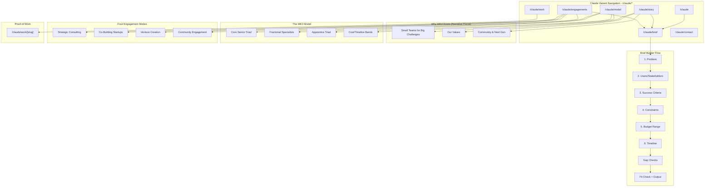

# WE3 Agency Website Rebuild - Implementation Plan (Claude Variant)

## Overview
- **Design Direction:** Curated Collector → Domestic (warm, eclectic, gallery-like)
- **Scope:** Full site + deterministic brief builder (V0 - no external API)
- **Target:** Friends & family beta (MVP)
- **Stack:** Astro 4.x + TypeScript, vanilla CSS powered by generated token variables
- **Variant:** Claude (B) - "Conceptual, narrative, and editorial interpretation"
- **Themes:** Light + Dark modes only

## Baseline Constraints (Level Playing Field)
- **Tokens-first styling:** All visual values from `tokens/tokens.json` → Style Dictionary → generated CSS/TS
- **CSS isolation:** All styles scoped under `[data-variant='claude']`
- **Brief builder:** Deterministic/local with dummy data, exports human-readable + JSON artifacts
- **Pricing posture:** Fixed time/price/people public; numeric weekly rate private (after brief)
- **Case studies:** Illustrative only (labeled as such), no real client logos/brands
- **Analytics:** Optional PostHog, no PII
- **Responsive:** Required across common breakpoints

---

## 0. A/B/C Variant Architecture

### Existing Structure
```
website/src/
├── pages/
│   ├── index.astro              # Variant chooser (root)
│   ├── antigravity/             # Gemini routes → imports from variants/antigravity/
│   ├── claude/                  # Claude routes → imports from variants/claude/
│   ├── codex/                   # Codex routes (placeholder)
│   └── original/                # Original routes
└── variants/
    ├── antigravity/             # Gemini: Strategic, clarity-focused
    ├── claude/                  # Claude: Conceptual, narrative, editorial (TO BUILD)
    ├── codex/                   # Codex: Sleek, tool-like (TBD)
    └── original/                # Current production site
```

### Claude Variant Structure (to create)
```
src/variants/claude/
├── layouts/
│   └── ClaudeLayout.astro       # Main layout with nav, footer
├── pages/
│   ├── Home.astro               # Landing page
│   ├── Story.astro              # Why WE3 exists (narrative focus)
│   ├── Model.astro              # Triad + three-layer team
│   ├── Engagements.astro        # Four engagement modes
│   ├── Work.astro               # Case studies
│   ├── Brief.astro              # Brief builder
│   └── Contact.astro            # Contact
├── components/
│   ├── Navigation.astro
│   ├── Card.astro
│   ├── BriefChat.astro
│   └── FitCheck.astro
├── styles/
│   └── global.css               # Design tokens (Curated Collector)
└── lib/
    └── brief-engine.ts          # Rules-based brief logic
```

### Content Structure (Astro Collections)
```
src/content/
├── config.ts                    # Shared collection config
├── pages/
│   ├── claude/                  # Claude variant pages
│   │   ├── home.md
│   │   ├── story.md
│   │   ├── model.md
│   │   ├── engagements.md
│   │   ├── work.md
│   │   └── contact.md
│   └── shared/                  # Optional shared content
├── case-studies/
│   └── claude/                  # Claude variant case studies (illustrative)
└── posts/
    └── claude/                  # Claude variant blog posts (if needed)
```

**Promotion workflow:** Winning variant folder renamed to `original`; others kept for future A/B but hidden in prod.

---

## 1. Site Map (Mermaid) - Updated for PRD v0.2



### Page Hierarchy (Claude Variant)
```
/claude                     # Home - Why WE3, value prop, CTA
/claude/story               # The WE3 Story (narrative, values, community)
/claude/model               # Three-layer team model explained
  - Core Senior Triad (Product/Design/Engineering)
  - Fractional Specialists (surge capacity)
  - Apprentice Triad (next generation)
  - Cost/Timeline Bands
/claude/engagements         # Four engagement modes
  - Strategic Consulting (industry leaders)
  - Co-Building Startups (venture partner)
  - Venture Creation (internal incubation)
  - Community Engagement (resources, tools, events)
/claude/work                # Case studies listing
/claude/work/[slug]         # Individual case study
/claude/brief               # Brief Builder (fast-pass chat)
/claude/contact             # Contact / Book a call
```

### Three User Segments (PRD v0.2)
1. **Clients seeking clarity** - PE/corp innovation, founders, operators
2. **Product dev community** - Builders who use our tools/resources
3. **Next generation** - Apprentices looking for real work + mentorship

---

## 2. Tokens Pipeline & Design System

### Tokens-First Architecture
**Source of truth:** `tokens/tokens.json` (ONLY editable source)
**Build tool:** Style Dictionary
**Generated outputs (committed):**
- `src/styles/tokens.generated.css` - CSS custom properties for light/dark
- `src/tokens/tokens.generated.ts` - TypeScript constants

**NO hard-coded colors, spacing, typography, or radius in CSS files.**

### Claude Variant: "Curated Collector → Domestic" Aesthetic
**Tone:** Warm, confident, curious, slightly unexpected
**Feel:** A thoughtfully curated space - gallery meets design studio

### Token Structure (in tokens/tokens.json)
```json
{
  "color": {
    "light": {
      "bg": { "value": "#f6f1e8" },
      "surface": { "value": "#fffaf3" },
      "surface-2": { "value": "#f3ede2" },
      "text": { "value": "#1b1b1b" },
      "muted": { "value": "#6e6961" },
      "border": { "value": "#d8d2c9" },
      "accent": { "value": "#3a7f65" },
      "accent-gold": { "value": "#e4b96c" },
      "accent-terracotta": { "value": "#c0715a" },
      "accent-navy": { "value": "#435f9c" },
      "button-text": { "value": "#fdfbf7" }
    },
    "dark": {
      "bg": { "value": "#1a1a1a" },
      "surface": { "value": "#242424" },
      "text": { "value": "#f5f5f5" }
    }
  },
  "typography": {
    "font-display": { "value": "Cormorant Garamond, serif" },
    "font-body": { "value": "Work Sans, sans-serif" },
    "font-accent": { "value": "IBM Plex Mono, monospace" }
  },
  "spacing": { },
  "radius": {
    "default": { "value": "14px" },
    "lg": { "value": "18px" }
  },
  "shadow": {
    "default": { "value": "0 12px 30px rgba(0,0,0,0.08)" },
    "lg": { "value": "0 20px 50px rgba(0,0,0,0.12)" }
  }
}
```

### CSS Isolation (Required)
All variant CSS must be scoped under:
```css
[data-variant='claude'] {
  /* All Claude styles here */
}
```

### Design Intent
The Claude variant interprets the PRD through the Curated Collector → Domestic lens - treating the site as a thoughtfully curated space where ideas, values, and engagement modes are presented as objects in a collection. Novel visual ideas may extend tokens (within WE3 spirit) but must remain semantic and support light + dark modes.

---

## 3. Brief Builder (V0 - Deterministic/Local)

### Baseline Requirement
V0 is **deterministic and local** (no external LLM/API). Must feel real with dummy data plumbed through.

**Full autonomy on:**
- Steps/questions flow
- UI/UX presentation
- Output formats (beyond required exports)

**Required exports:**
1. **Human-readable artifact** (e.g., formatted markdown, PDF-ready view)
2. **JSON artifact** (structured brief data)

### How it works:
- Deterministic prompt flow with conditional logic
- Gap detection via rule-based checks (missing budget, vague success criteria)
- Fit check mapping: budget/scope/urgency → crew shape + cost band
- Dummy data for realistic feel during demo

### Pricing Posture (in Brief Output)
- **Public:** Fixed time, fixed price, fixed set of people (WE3), booked weekly
- **Public:** Can mention parallel teams and successive weeks
- **Private:** Numeric weekly rate and detailed breakdown (discussed after brief submission)

---

## 4. Implementation Approach

### Claude Variant Files to Create

**Layouts:**
```
src/variants/claude/layouts/
  ClaudeLayout.astro      # Main layout (nav, footer, global styles)
```

**Pages:**
```
src/variants/claude/pages/
  Home.astro              # Landing - story-first, why WE3
  Story.astro             # Full narrative (values, community, vision)
  Model.astro             # Three-layer team visualization
  Engagements.astro       # Four engagement modes as collection
  Work.astro              # Case studies gallery
  Brief.astro             # Brief builder interface
  Contact.astro           # Contact + book a call
```

**Components:**
```
src/variants/claude/components/
  Navigation.astro        # Gallery-style nav
  Card.astro              # Object-like cards
  ValueCard.astro         # Six values display
  EngagementCard.astro    # Engagement mode cards
  TeamLayer.astro         # Triad/fractional/apprentice viz
  BriefChat.astro         # Chat interface
  FitCheck.astro          # Crew shape + cost bands output
```

**Routes to Update:**
```
src/pages/claude/
  index.astro             # → import Home from variants/claude/pages/Home.astro
  story.astro             # → import Story
  model.astro             # → import Model
  engagements.astro       # → import Engagements
  work/index.astro        # → import Work
  work/[slug].astro       # → dynamic case studies
  brief.astro             # → import Brief
  contact.astro           # → import Contact
```

### Brief Builder Integration
- Page: `/claude/brief` with Astro shell
- Vanilla JS/TS for interactivity
- Deterministic engine in `src/variants/claude/lib/brief-engine.ts`
- Dummy data in `src/variants/claude/data/` for realistic demo feel

### Case Studies (Illustrative)
- Full autonomy on proof format and illustrative case studies
- **Must clearly label as illustrative**
- No real client logos/brands or implied real outcomes
- Prefer original/abstract/diagram/royalty-free imagery

### Data Files
```
src/variants/claude/data/
  cost-bands.json         # Cost/timeline band definitions
  crew-shapes.json        # Team composition data
  fit-check-rules.json    # Brief → fit check mapping
  dummy-briefs.json       # Sample brief data for demo
```

---

## 5. Phased Delivery

### MVP (Friends & Family Beta) - Claude Variant

**Phase 0: Tokens Pipeline**
- [ ] Create/extend `tokens/tokens.json` with Claude variant tokens
- [ ] Configure Style Dictionary build
- [ ] Generate and commit `src/styles/tokens.generated.css`
- [ ] Generate and commit `src/tokens/tokens.generated.ts`

**Phase 1: Foundation**
- [ ] Create `src/variants/claude/` folder structure
- [ ] Create `ClaudeLayout.astro` consuming generated tokens
- [ ] Implement CSS isolation (`[data-variant='claude']`)
- [ ] Set up font loading (Cormorant Garamond, Work Sans, IBM Plex Mono)
- [ ] Create `src/content/pages/claude/` folder structure
- [ ] Update `/claude/index.astro` route to import from variant

**Phase 2: Core Pages (Story-First)**
- [ ] Home page - Why WE3 exists, value prop, primary CTA
- [ ] Story page - Full narrative, values, community vision
- [ ] Model page - Three-layer team visualization
- [ ] Engagements page - Four modes as curated collection
- [ ] Work page - Illustrative case studies gallery (clearly labeled)
- [ ] Contact page - Contact form + book a call CTA
- [ ] Responsive design across common breakpoints

**Phase 3: Brief Builder**
- [ ] `/claude/brief` page shell
- [ ] `brief-engine.ts` - Deterministic rules-based logic
- [ ] Dummy data for realistic demo feel
- [ ] Full autonomy on steps/questions flow
- [ ] Gap checks (budget, success criteria, constraints)
- [ ] Fit check visualization (crew shape + cost bands)
- [ ] **Required:** Human-readable export (markdown/formatted)
- [ ] **Required:** JSON export (structured brief data)
- [ ] Pricing posture: fixed team/week public, rate private
- [ ] Privacy notice ("Your data stays local")
- [ ] Post-brief CTA: Book a call

**Phase 4: Polish & Integration**
- [ ] Light + dark theme support
- [ ] Analytics integration (PostHog, optional, no PII)
- [ ] Cross-browser testing
- [ ] Mobile responsiveness verification

### Deferred to V1
- Short-lived collaboration links (R4)
- "What would need to be true" risk block (N1)
- Lane hinting by segment (N2)
- Clarity micro-survey (N3)
- External API integration for brief builder

---

## 6. Critical Files

### Tokens Pipeline (Create/Update)
| File | Purpose |
|------|---------|
| `tokens/tokens.json` | Source of truth for all design tokens |
| `style-dictionary.config.js` | Style Dictionary configuration |
| `src/styles/tokens.generated.css` | Generated CSS custom properties (light/dark) |
| `src/tokens/tokens.generated.ts` | Generated TypeScript constants |

### Variant Files to Create
| File | Purpose |
|------|---------|
| `src/variants/claude/layouts/ClaudeLayout.astro` | Main layout (scoped with `[data-variant='claude']`) |
| `src/variants/claude/styles/claude.css` | Variant-specific styles (consuming tokens) |
| `src/variants/claude/pages/Home.astro` | Landing page |
| `src/variants/claude/pages/Story.astro` | Narrative page |
| `src/variants/claude/pages/Model.astro` | Team model page |
| `src/variants/claude/pages/Engagements.astro` | Engagement modes |
| `src/variants/claude/pages/Work.astro` | Case studies (illustrative) |
| `src/variants/claude/pages/Brief.astro` | Brief builder |
| `src/variants/claude/pages/Contact.astro` | Contact page |
| `src/variants/claude/lib/brief-engine.ts` | Deterministic brief logic |
| `src/variants/claude/data/dummy-briefs.json` | Sample data for demo |

### Content Files to Create
| File | Purpose |
|------|---------|
| `src/content/pages/claude/home.md` | Home page content |
| `src/content/pages/claude/story.md` | Story content |
| `src/content/pages/claude/model.md` | Model content |
| `src/content/pages/claude/engagements.md` | Engagements content |
| `src/content/pages/claude/work.md` | Work/case studies content |
| `src/content/pages/claude/contact.md` | Contact content |
| `src/content/case-studies/claude/*.md` | Illustrative case studies |

### Routes to Update
| File | Purpose |
|------|---------|
| `src/pages/claude/index.astro` | Route to import Home.astro |
| `src/pages/claude/*.astro` | Routes for all Claude pages |

### Reference Files
| File | Purpose |
|------|---------|
| `design-exploration/curated-collector.css` | Design token reference |
| `design-exploration/brief_the-curated-collector.md` | Aesthetic guide |
| `docs/WE3-PRD-v0.2.md` | Requirements |
| `docs/Small Teams for Big Challenges.md` | Story content |
| `docs/plan-adjustments-claude.md` | Baseline constraints |

---

## 7. Verification

### Tokens Pipeline
```bash
# Build tokens
npm run build:tokens  # or equivalent Style Dictionary command

# Verify generated files exist and are committed
ls src/styles/tokens.generated.css
ls src/tokens/tokens.generated.ts
```

### Run the Dev Server
```bash
cd /Users/chadcribbins/Work/WE3io/_studio/agency-website/website
pnpm dev
```

### Variant Chooser
- Visit `http://localhost:4321/` - should show variant chooser
- Click "Claude" card - should navigate to `/claude`

### Claude Variant Pages
- `/claude` - Home loads with Curated Collector → Domestic styling
- `/claude/story` - Narrative page renders
- `/claude/model` - Team layers visualize
- `/claude/engagements` - Four modes display
- `/claude/work` - Illustrative case studies gallery (clearly labeled)
- `/claude/brief` - Brief builder functional
- `/claude/contact` - Contact form works

### CSS Isolation
- Verify all Claude styles are scoped under `[data-variant='claude']`
- No style leakage to other variants
- Toggle between variants and confirm styles don't bleed

### Brief Builder Flow
- Complete full prompt sequence
- Trigger gap checks (omit budget, vague success criteria)
- Verify fit check shows crew shape + cost band
- **Required:** Test human-readable export (verify artifact generated)
- **Required:** Test JSON export (verify structured data)
- Verify pricing posture: fixed team/week visible, no numeric rate shown
- Confirm privacy notice visible

### Responsive Design
- Test on desktop (1440px+)
- Test on tablet (768px-1024px)
- Test on mobile (375px-767px)
- Verify all breakpoints functional

### Theme Support
- Test light mode
- Test dark mode
- Verify all tokens resolve correctly in both themes

### Design Quality
- Fonts load correctly (Cormorant Garamond for display)
- Colors from generated tokens (no hard-coded values)
- Cards feel like "objects in a collection"
- Navigation feels gallery-like

### Cross-browser
- Chrome
- Safari
- Firefox

## 8. Checklist (Plan Compliance)

- [ ] Includes tokens pipeline tasks (Style Dictionary) and committed generated outputs
- [ ] Calls out content folder structure per variant (`src/content/pages/claude`)
- [ ] Defines brief builder as local/deterministic with dummy data and export requirement (human + JSON)
- [ ] States pricing posture correctly (fixed people public, numeric weekly rate private)
- [ ] Requires responsive design across breakpoints
- [ ] Requires variant CSS isolation strategy (`[data-variant='claude']`)
- [ ] Allows autonomy on tone, IA, case study format, imagery, analytics instrumentation
