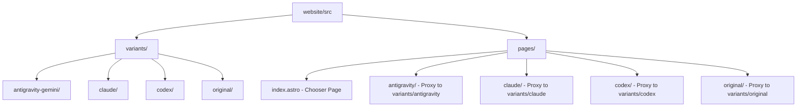
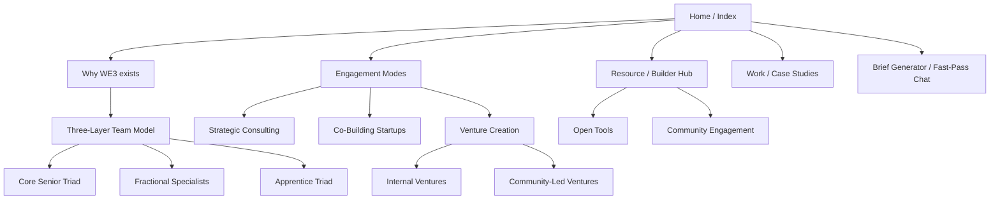

# Agency Website Update Plan (v0.2)

This plan outlines the steps to update the agency website based on the **WE3 PRD v0.2** and design exploration concepts.

## Decisions & Recommendations

> [!IMPORTANT]
> Based on the Post-Conversation Baseline, we've adjusted the plan for V0:
> 1.  **Architecture**: Side-by-side routes (`/antigravity`, `/claude`, `/codex`, `/original`).
> 2.  **Styling**: **Vanilla CSS only** with a **Style Dictionary** tokens pipeline (`tokens/tokens.json`). **Rule**: Extend visual ideas through tokens only; no hard-coded CSS values.
> 3.  **Design Direction**: **Curated Collector Domestic** as a starting reference. Extend freely while maintaining semantic, theme-aware tokens (Light + Dark).
> 4.  **Content Model**: Variant-scoped collections (`src/content/pages/<variant>/`).
> 5.  **Brief Builder (V0)**: **Deterministic & Local** (No external AI/API). Human/JSON exports required.
> 6.  **Pricing Focus**: Publicly fixed-team/weekly booking; numeric rates revealed only after brief.
> 7.  **Analytics**: PostHog per-variant (no PII, disabled by default in V0).
> 8.  **CSS Isolation**: Scoped selectors required to prevent style leakage.

## Proposed Architecture: Side-by-Side Routes (Alpha/Beta/Gamma)

Following Codex's recommendation, we will use a **single Astro project** with isolated directory structures for each agent. This is much simpler for comparison (path-based switching) and dependency management.

## Updated Information Architecture (PRD v0.2)

The discovery phase of the site will now prioritize the "WE3 Story" and the "Three-Layer Team Model", blending consultancy with venture building.

### Community & Next Generation (Remit)
- **Builder Hub**: A dedicated area where other builders can access our open resources, tools, and playbooks to accelerate their own workflows.
- **Apprentice Pipeline**: Explicitly detailing the "Mentorship Gap" in the industry and how WE3 bridges it by embedding apprentices alongside senior veterans.
- **Community-Led Ventures**: Highlighting how WE3 sources and incubates ideas from its wider community of innovators.

### Setup Steps:
1.  **Tokens Pipeline**: Set up Style Dictionary to process `tokens/tokens.json` into `src/styles/tokens.generated.css` and `src/tokens/tokens.generated.ts`.
2.  **Content Structure**: Organize markdown under `src/content/pages/antigravity/` and `src/content/posts/antigravity/`.
3.  **Path Proxies**: `src/pages/antigravity/index.astro` renders the localized variant home.
4.  **CSS Isolation**: All Antigravity styles must be nested under a `.variant-antigravity` root selector.

## Gotchas & Considerations

> [!CAUTION]
> 1. **Shared Config**: All agents must use the same Astro plugins and Vite configuration. If Gemini wants a React plugin and Codex doesn't, they will both have it available (which is fine, but adds to the bundle).
> 2. **Dependency Conflicts**: If different versions require different versions of the same library, we will have to settle on one version in the root `package.json`.
> 3. **Global Styles**: We must ensure each agent scopes their CSS (using Astro's default scoped behavior or scoped CSS modules) to avoid leaking styles into other versions.

## Tech Stack & Gap Analysis (v0.2 - Baseline Updated)

| Component | Current / Selected | Gap / Decision Needed |
| :--- | :--- | :--- |
| **Core Framework** | Astro 4.x | None |
| **Tokens** | **Style Dictionary** | Setup `tokens/tokens.json` pipeline |
| **Styling** | **Vanilla CSS** | Scoped nesting for isolation |
| **Brief Builder** | Deterministic Local | Define V0 logic & dummy data |
| **Analytics** | **PostHog** | Disable default autocapture (PII protection) |
| **Hosting** | Localhost | Recommendation for Vercel/Cloudflare |

### Addressing Gaps
1.  **Tokens**: We'll use Style Dictionary to ensure a single source of truth. Any novel visual ideas (shadows, borders, specific colors) must be added as tokens first.
2.  **Brief Builder**: Transitioning from "AI-like" to a **deterministic flow**. It will map inputs directly to WE3's weekly booking model without external API dependencies.
3.  **Pricing**: The output will emphasize the "Core Senior Triad + Apprentices" model with fixed weekly slots.
4.  **Isolation**: We will use a BEM-like or root-nested strategy (e.g. `.variant-antigravity`) to ensure No-Leak styling.

---

## Fit Check & Pricing (Deterministic Logic)

We will map user inputs to a **Weekly Booking Model**:

| Complexity | Scope | Baseline Recommendation | Output Strategy |
| :--- | :--- | :--- | :--- |
| Low | Focused Audit / MVP | **1-2 Core Weeks** | Highlight triad depth |
| Medium | Full Build / Launch | **4-8 Core Weeks** | Add fractional nudge |
| High | Venture Incubation | **Successive Slots** | Long-term roadmap |

**Pricing Note**: Numeric rates (e.g. £/$ per week) are excluded from the public UI. The builder output will state: *"Crew shape confirmed. Final weekly rate available upon review."*

## Proposed Changes

### [website] - Astro Infrastructure

#### [MODIFY] [astro.config.mjs](file:///Users/chadcribbins/Work/WE3io/_studio/agency-website/website/astro.config.mjs)
- Update configuration to support selected design tokens and styling (e.g., Tailwind or CSS modules).

#### [NEW] [design-tokens.css](file:///Users/chadcribbins/Work/WE3io/_studio/agency-website/website/src/styles/design-tokens.css)
- Define variables for colors, typography, spacing, and shadows based on the selected design direction.

#### [NEW] [BriefGenerator.astro](file:///Users/chadcribbins/Work/WE3io/_studio/agency-website/website/src/components/BriefGenerator.astro)
- Implement the "Fast-Pass Chat" component.

#### [NEW] [FitCheck.ts](file:///Users/chadcribbins/Work/WE3io/_studio/agency-website/website/src/lib/FitCheck.ts)
- Logic for mapping brief inputs to crew shapes and cost/timeline bands.

### [content] - Content Updates

#### [MODIFY] pages and posts
- Update existing content to align with the new PRD goals (Triad model, Crew shapes, etc.).

## Verification Plan

### Automated Tests
- Run `npm run build` to ensure the Astro site builds correctly.
- Add Vitest for FitCheck logic verification.

### Manual Verification
- Test the Brief Generator flow: completion -> fit check -> output options.
- Verify "no server storage" by checking Network tab during share link generation.
- Review design on mobile/desktop for responsiveness and fidelity to the selected concept.
