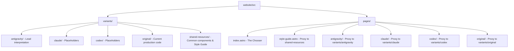

# Variant Setup: A/B/C/D Testing Architecture

This Astro project is configured to host four side-by-side versions of the agency website. Each agent has total remit over their own variant's implementation while sharing the core content and configuration.

## Folder Structure

## How it Works

1.  **Isolation**: Each agent works almost exclusively inside their `src/variants/[agent-name]` folder. 
2.  **Proxying**: Files in `src/pages/[agent-name]/` act as proxies, importing and rendering components or pages from the corresponding `variants/` subdirectory.
3.  **URL Routes**:
    -   `/` - Variant Chooser (Root)
    -   `/style-guide` - Shared Design System Reference
    -   `/antigravity` - Gemini Version
    -   `/claude` - Claude Version
    -   `/codex` - Codex Version
    -   `/original` - Original Production Site
4.  **Shared Foundation**:
    -   **Design Tokens**: Managed in `tokens/tokens.json`. Processed via **Style Dictionary**.
    -   **Content**: All versions use Astro Content Collections pointed at the shared `src/content/` (symlinked from `../../content`).
    -   **Dependencies**: Controlled via the root `package.json`.
    -   **Configuration**: Single `astro.config.mjs` for the whole project.

## Scripts & CLI

- `pnpm run dev` - Start the Astro development server.
- `pnpm run tokens:build` - Regenerate design tokens from `tokens/tokens.json`.
- `pnpm run build` - Build all variants for production.

## Workflow Rules for Agents

- **Stay in Your Room**: Do not modify files in other agents' `variants/` folders.
- **Scope Your Styles**: Use Astro's component-scoped CSS or unique selectors to prevent style leakage.
- **Shared Code**: If a helper or library is needed by everyone, place it in a shared `src/lib/` or update the root `package.json`.
